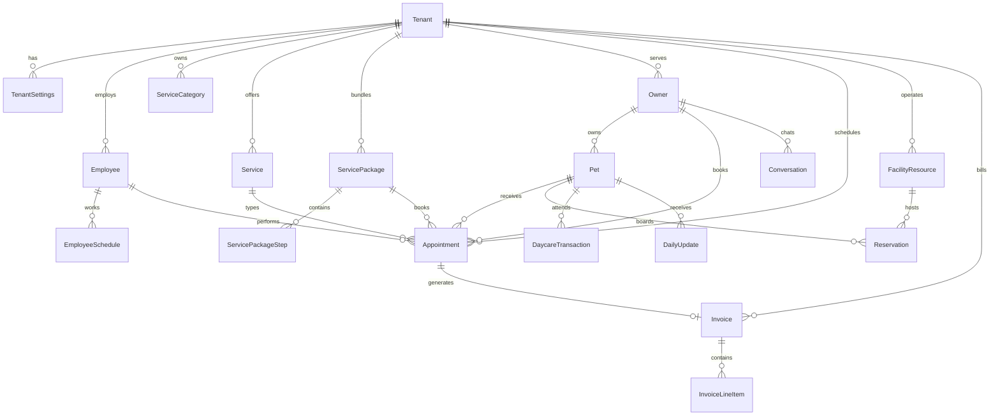

# Pet Care Booking Platform — Architecture & Schema

This document defines the **system architecture** and **complete database schema** needed to clone the Petverse-style pet care booking platform. It extends the existing Prisma schema in `backend/prisma/schema.prisma` (auth + tenants + RBAC).

---

## System architecture

### High-level diagram

```
┌─────────────────────────────────────────────────────────────────────────┐
│                         Client applications                              │
├──────────────────────┬──────────────────────┬───────────────────────────┤
│  Public SPA          │  Admin SPA           │  Staff mobile/light UI    │
│  /, /book, /pay      │  /admin/*            │  /staff/daily_pet_updates │
└──────────┬───────────┴──────────┬───────────┴─────────────┬─────────────┘
           │                      │                         │
           ▼                      ▼                         ▼
┌─────────────────────────────────────────────────────────────────────────┐
│                    NestJS API  (/api)                                    │
├─────────────┬──────────────┬──────────────┬──────────────┬──────────────┤
│ Identity    │ Platform     │ Catalog      │ Scheduling   │ Clients      │
│ Auth, RBAC  │ Tenants      │ Services     │ Appointments │ Owners, Pets │
├─────────────┼──────────────┼──────────────┼──────────────┼──────────────┤
│ Boarding    │ Daycare      │ Billing      │ Comms        │ Inventory    │
│ Rooms       │ Check-in     │ Invoices     │ Campaigns    │ Products     │
└─────────────┴──────────────┴──────────────┴──────────────┴──────────────┘
           │                      │                         │
           ▼                      ▼                         ▼
┌──────────────────┐    ┌──────────────────┐    ┌──────────────────────┐
│  PostgreSQL      │    │  Redis (optional) │    │  Object storage      │
│  Prisma ORM      │    │  slot cache       │    │  pet photos, docs    │
└──────────────────┘    └──────────────────┘    └──────────────────────┘
           │
           ▼
┌──────────────────────────────────────────────────────────────────────────┐
│  External integrations (phase later)                                      │
│  Stripe/Square · WhatsApp Business API · Resend/SendGrid · Webhooks    │
└──────────────────────────────────────────────────────────────────────────┘
```

### Layer responsibilities

| Layer | Technology | Responsibility |
|-------|------------|----------------|
| **Public frontend** | Vite + React + Tailwind + shadcn | Landing, booking wizard, pay link, passport |
| **Admin frontend** | Same monorepo app, `/admin` routes | All operational modules |
| **API** | NestJS 11 | REST, validation, RBAC guards, tenant isolation |
| **Database** | PostgreSQL + Prisma 7 | Single source of truth, migrations |
| **Auth** | JWT + bcrypt | Staff users; public booking is unauthenticated |
| **Files** | S3-compatible storage | Photos, consent PDFs, campaign assets |

### API route conventions

```
/api/auth/*                          # Public — staff login/register
/api/permissions                     # JWT — permission catalog

/api/tenants/*                       # JWT — tenant CRUD (existing)
/api/tenants/:tenantId/members/*     # JWT + RBAC (existing)
/api/tenants/:tenantId/roles/*       # JWT + RBAC (existing)

/api/tenants/:tenantId/catalog/*     # Services, categories, packages
/api/tenants/:tenantId/staff/*       # Employees, schedules, assignments
/api/tenants/:tenantId/clients/*     # Owners, pets
/api/tenants/:tenantId/appointments/*
/api/tenants/:tenantId/boarding/*
/api/tenants/:tenantId/daycare/*
/api/tenants/:tenantId/billing/*
/api/tenants/:tenantId/communications/*
/api/tenants/:tenantId/inventory/*
/api/tenants/:tenantId/settings/*

/api/public/:tenantSlug/*            # No auth — book flow, catalog, lookup
/api/public/pay/:token               # No auth — payment page
/api/public/passport/:petId          # Optional token — pet profile
```

### Multi-tenancy rules

1. Every business table includes `tenantId` (FK → `Tenant`).
2. Admin routes require JWT + `TenantGuard` + permission check.
3. Public routes resolve tenant by `slug`; never accept raw `tenantId` from client.
4. Owners and pets belong to a tenant; phone uniqueness is **per tenant**, not global.

---

## Existing schema (implemented)

These models already exist in `backend/prisma/schema.prisma`:

| Model | Purpose |
|-------|---------|
| `User` | Staff login identity (email + password) |
| `Tenant` | Business account (`name`, `slug`) |
| `Role` | Tenant-scoped or system roles |
| `Permission` | Global permission catalog |
| `RolePermission` | Role ↔ permission join |
| `Membership` | User ↔ tenant ↔ role |

---

## Domain schema (to implement)

Below is the **target Prisma schema** organized by bounded context. Enums and field names follow patterns observed in the reference app bundle.

### Platform & settings

```prisma
model TenantSettings {
  id              String   @id @default(uuid()) @db.Uuid
  tenantId        String   @unique @map("tenant_id") @db.Uuid
  tenant          Tenant   @relation(fields: [tenantId], references: [id], onDelete: Cascade)

  displayName     String   @map("display_name") @db.VarChar(255)
  logoUrl         String?  @map("logo_url")
  timezone        String   @default("UTC") @db.VarChar(64)
  currency        String   @default("USD") @db.VarChar(3)
  locale          String   @default("en") @db.VarChar(10)

  phone           String?  @db.VarChar(32)
  email           String?  @db.VarChar(255)
  address         String?

  // Landing page content (JSON or separate CMS later)
  heroTitle       String?  @map("hero_title")
  heroSubtitle    String?  @map("hero_subtitle")

  createdAt       DateTime @default(now()) @map("created_at") @db.Timestamptz(6)
  updatedAt       DateTime @updatedAt @map("updated_at") @db.Timestamptz(6)

  @@map("tenant_settings")
}

model BusinessTarget {
  id          String   @id @default(uuid()) @db.Uuid
  tenantId    String   @map("tenant_id") @db.Uuid
  tenant      Tenant   @relation(fields: [tenantId], references: [id], onDelete: Cascade)

  name        String   @db.VarChar(100)
  metricKey   String   @map("metric_key") @db.VarChar(64)  // e.g. revenue, bookings
  targetValue Decimal  @map("target_value") @db.Decimal(12, 2)
  period      String   @db.VarChar(20)  // monthly, weekly

  createdAt   DateTime @default(now()) @map("created_at") @db.Timestamptz(6)
  updatedAt   DateTime @updatedAt @map("updated_at") @db.Timestamptz(6)

  @@index([tenantId])
  @@map("business_targets")
}
```

---

### Staff (employees)

Staff users are `User` + `Membership` + an `Employee` profile per tenant.

```prisma
enum EmployeeRole {
  ADMIN
  VETERINARIAN
  GROOMER
  BOARDING_ATTENDANT
  VET_TECHNICIAN
  RECEPTIONIST
}

model Employee {
  id            String        @id @default(uuid()) @db.Uuid
  tenantId      String        @map("tenant_id") @db.Uuid
  tenant        Tenant        @relation(fields: [tenantId], references: [id], onDelete: Cascade)
  userId        String?       @map("user_id") @db.Uuid
  user          User?         @relation(fields: [userId], references: [id], onDelete: SetNull)

  displayName   String        @map("display_name") @db.VarChar(255)
  initials      String?       @db.VarChar(4)
  avatarUrl     String?       @map("avatar_url")
  role          EmployeeRole
  jobTitle      String?       @map("job_title") @db.VarChar(100)
  commissionPct Decimal?      @map("commission_pct") @db.Decimal(5, 2)
  isActive      Boolean       @default(true) @map("is_active")
  color         String?       @db.VarChar(7)  // calendar column color

  schedules     EmployeeSchedule[]
  serviceLinks  EmployeeService[]
  appointments  Appointment[]
  commissionTiers EmployeeCommissionTier[]

  createdAt     DateTime @default(now()) @map("created_at") @db.Timestamptz(6)
  updatedAt     DateTime @updatedAt @map("updated_at") @db.Timestamptz(6)

  @@unique([tenantId, userId])
  @@index([tenantId])
  @@map("employees")
}

model EmployeeSchedule {
  id          String   @id @default(uuid()) @db.Uuid
  employeeId  String   @map("employee_id") @db.Uuid
  employee    Employee @relation(fields: [employeeId], references: [id], onDelete: Cascade)

  dayOfWeek   Int      @map("day_of_week")  // 0=Sun .. 6=Sat
  startTime   String   @map("start_time") @db.VarChar(5)  // "09:00"
  endTime     String   @map("end_time") @db.VarChar(5)

  @@index([employeeId])
  @@map("employee_schedules")
}

model EmployeeService {
  employeeId  String   @map("employee_id") @db.Uuid
  serviceId   String   @map("service_id") @db.Uuid
  employee    Employee @relation(fields: [employeeId], references: [id], onDelete: Cascade)
  service     Service  @relation(fields: [serviceId], references: [id], onDelete: Cascade)

  @@id([employeeId, serviceId])
  @@map("employee_services")
}

model EmployeeCommissionTier {
  id          String   @id @default(uuid()) @db.Uuid
  employeeId  String   @map("employee_id") @db.Uuid
  employee    Employee @relation(fields: [employeeId], references: [id], onDelete: Cascade)

  minRevenue  Decimal  @map("min_revenue") @db.Decimal(12, 2)
  commissionPct Decimal @map("commission_pct") @db.Decimal(5, 2)

  @@index([employeeId])
  @@map("employee_commission_tiers")
}
```

---

### Catalog (services & packages)

```prisma
enum ServiceKind {
  GROOMING
  VETERINARY
  BOARDING
  DAYCARE
  OTHER
}

model ServiceCategory {
  id          String   @id @default(uuid()) @db.Uuid
  tenantId    String   @map("tenant_id") @db.Uuid
  tenant      Tenant   @relation(fields: [tenantId], references: [id], onDelete: Cascade)

  name        String   @db.VarChar(100)
  slug        String   @db.VarChar(100)
  description String?
  sortOrder   Int      @default(0) @map("sort_order")
  isActive    Boolean  @default(true) @map("is_active")

  services    Service[]

  createdAt   DateTime @default(now()) @map("created_at") @db.Timestamptz(6)
  updatedAt   DateTime @updatedAt @map("updated_at") @db.Timestamptz(6)

  @@unique([tenantId, slug])
  @@index([tenantId])
  @@map("service_categories")
}

model Service {
  id              String          @id @default(uuid()) @db.Uuid
  tenantId        String          @map("tenant_id") @db.Uuid
  tenant          Tenant          @relation(fields: [tenantId], references: [id], onDelete: Cascade)
  categoryId      String?         @map("category_id") @db.Uuid
  category        ServiceCategory? @relation(fields: [categoryId], references: [id], onDelete: SetNull)

  name            String          @db.VarChar(255)
  description     String?
  kind            ServiceKind     @default(OTHER)
  durationMinutes Int             @map("duration_minutes")
  price           Decimal         @db.Decimal(10, 2)
  isActive        Boolean         @default(true) @map("is_active")
  isPublic        Boolean         @default(true) @map("is_public")  // show on /book

  employeeLinks   EmployeeService[]
  packageSteps    ServicePackageStep[]
  consentLinks    ServiceConsentForm[]
  appointments    Appointment[]

  createdAt       DateTime @default(now()) @map("created_at") @db.Timestamptz(6)
  updatedAt       DateTime @updatedAt @map("updated_at") @db.Timestamptz(6)

  @@index([tenantId])
  @@index([categoryId])
  @@map("services")
}

enum PackageStepMode {
  SEQUENTIAL
  PARALLEL
}

model ServicePackage {
  id              String   @id @default(uuid()) @db.Uuid
  tenantId        String   @map("tenant_id") @db.Uuid
  tenant          Tenant   @relation(fields: [tenantId], references: [id], onDelete: Cascade)

  name            String   @db.VarChar(255)
  description     String?
  price           Decimal  @db.Decimal(10, 2)
  durationMinutes Int      @map("duration_minutes")
  stepMode        PackageStepMode @default(SEQUENTIAL) @map("step_mode")
  depositAmount   Decimal? @map("deposit_amount") @db.Decimal(10, 2)
  discountPct     Decimal? @map("discount_pct") @db.Decimal(5, 2)
  isActive        Boolean  @default(true) @map("is_active")

  steps           ServicePackageStep[]
  appointments    Appointment[]

  createdAt       DateTime @default(now()) @map("created_at") @db.Timestamptz(6)
  updatedAt       DateTime @updatedAt @map("updated_at") @db.Timestamptz(6)

  @@index([tenantId])
  @@map("service_packages")
}

model ServicePackageStep {
  id                    String         @id @default(uuid()) @db.Uuid
  packageId             String         @map("package_id") @db.Uuid
  package               ServicePackage @relation(fields: [packageId], references: [id], onDelete: Cascade)
  serviceId             String         @map("service_id") @db.Uuid
  service               Service        @relation(fields: [serviceId], references: [id], onDelete: Restrict)

  stepOrder             Int            @map("step_order")
  parallelGroup         Int?           @map("parallel_group")  // same group = run together
  overrideDurationMinutes Int?         @map("override_duration_minutes")
  overridePrice         Decimal?       @map("override_price") @db.Decimal(10, 2)

  @@index([packageId])
  @@map("service_package_steps")
}
```

---

### Clients (owners & pets)

```prisma
model Owner {
  id                  String   @id @default(uuid()) @db.Uuid
  tenantId            String   @map("tenant_id") @db.Uuid
  tenant              Tenant   @relation(fields: [tenantId], references: [id], onDelete: Cascade)

  name                String   @db.VarChar(255)
  phone               String   @db.VarChar(32)
  email               String?  @db.VarChar(255)
  preferredContact    String?  @map("preferred_contact") @db.VarChar(20)  // phone, email, whatsapp

  lifetimeBookings    Int      @default(0) @map("lifetime_bookings")
  lifetimeSpend       Decimal  @default(0) @map("lifetime_spend") @db.Decimal(12, 2)
  lastVisitedAt       DateTime? @map("last_visited_at") @db.Timestamptz(6)

  pets                Pet[]
  appointments        Appointment[]
  invoices            Invoice[]
  conversations       Conversation[]
  retentionSettings   OwnerRetentionSetting?

  createdAt           DateTime @default(now()) @map("created_at") @db.Timestamptz(6)
  updatedAt           DateTime @updatedAt @map("updated_at") @db.Timestamptz(6)

  @@unique([tenantId, phone])
  @@index([tenantId])
  @@map("owners")
}

model Pet {
  id          String   @id @default(uuid()) @db.Uuid
  tenantId    String   @map("tenant_id") @db.Uuid
  tenant      Tenant   @relation(fields: [tenantId], references: [id], onDelete: Cascade)
  ownerId     String   @map("owner_id") @db.Uuid
  owner       Owner    @relation(fields: [ownerId], references: [id], onDelete: Cascade)

  name        String   @db.VarChar(255)
  species     String   @db.VarChar(50)   // dog, cat, ...
  breed       String?  @db.VarChar(100)
  birthDate   DateTime? @map("birth_date") @db.Date
  weightKg    Decimal? @map("weight_kg") @db.Decimal(6, 2)
  color       String?  @db.VarChar(50)
  microchip   String?  @db.VarChar(64)
  notes       String?
  avatarUrl   String?  @map("avatar_url")
  isActive    Boolean  @default(true) @map("is_active")

  appointments      Appointment[]
  vaccinations      PetVaccination[]
  boardingInstructions PetBoardingInstruction[]
  notes_log         PetNote[]
  documents         ClientDocument[]
  dailyUpdates      DailyUpdate[]
  photos            PetPhoto[]

  createdAt   DateTime @default(now()) @map("created_at") @db.Timestamptz(6)
  updatedAt   DateTime @updatedAt @map("updated_at") @db.Timestamptz(6)

  @@index([tenantId])
  @@index([ownerId])
  @@map("pets")
}

model PetNote {
  id        String   @id @default(uuid()) @db.Uuid
  petId     String   @map("pet_id") @db.Uuid
  pet       Pet      @relation(fields: [petId], references: [id], onDelete: Cascade)
  authorId  String?  @map("author_id") @db.Uuid
  body      String
  createdAt DateTime @default(now()) @map("created_at") @db.Timestamptz(6)

  @@index([petId])
  @@map("pet_notes")
}

model ClientDocument {
  id        String   @id @default(uuid()) @db.Uuid
  petId     String?  @map("pet_id") @db.Uuid
  pet       Pet?     @relation(fields: [petId], references: [id], onDelete: Cascade)
  ownerId   String?  @map("owner_id") @db.Uuid
  name      String   @db.VarChar(255)
  fileUrl   String   @map("file_url")
  createdAt DateTime @default(now()) @map("created_at") @db.Timestamptz(6)

  @@map("client_documents")
}
```

---

### Appointments & scheduling

```prisma
enum AppointmentStatus {
  REQUESTED
  CONFIRMED
  ARRIVED
  IN_SERVICE
  COMPLETED
  CANCELLED
  NO_SHOW
}

enum AppointmentSource {
  ONLINE
  ADMIN
  WHATSAPP
  PHONE
}

model Appointment {
  id              String            @id @default(uuid()) @db.Uuid
  tenantId        String            @map("tenant_id") @db.Uuid
  tenant          Tenant            @relation(fields: [tenantId], references: [id], onDelete: Cascade)

  ownerId         String            @map("owner_id") @db.Uuid
  owner           Owner             @relation(fields: [ownerId], references: [id], onDelete: Restrict)
  petId           String            @map("pet_id") @db.Uuid
  pet             Pet               @relation(fields: [petId], references: [id], onDelete: Restrict)

  serviceId       String?           @map("service_id") @db.Uuid
  service         Service?          @relation(fields: [serviceId], references: [id], onDelete: SetNull)
  packageId       String?           @map("package_id") @db.Uuid
  package         ServicePackage?   @relation(fields: [packageId], references: [id], onDelete: SetNull)

  employeeId      String?           @map("employee_id") @db.Uuid
  employee        Employee?         @relation(fields: [employeeId], references: [id], onDelete: SetNull)
  preferredEmployeeId String?       @map("preferred_employee_id") @db.Uuid

  status          AppointmentStatus @default(REQUESTED)
  source          AppointmentSource @default(ONLINE)

  startsAt        DateTime          @map("starts_at") @db.Timestamptz(6)
  endsAt          DateTime          @map("ends_at") @db.Timestamptz(6)
  durationMinutes Int               @map("duration_minutes")

  price           Decimal           @db.Decimal(10, 2)
  depositPaid     Decimal?          @map("deposit_paid") @db.Decimal(10, 2)

  // Package grouping: multiple rows share groupId
  groupId         String?           @map("group_id") @db.Uuid
  stepOrder       Int?              @map("step_order")

  notes           String?
  cancelledAt     DateTime?         @map("cancelled_at") @db.Timestamptz(6)
  cancelReason    String?           @map("cancel_reason")

  invoice         Invoice?
  lineItems       InvoiceLineItem[]
  consentSubmissions ConsentFormSubmission[]
  dailyUpdates    DailyUpdate[]

  createdAt       DateTime @default(now()) @map("created_at") @db.Timestamptz(6)
  updatedAt       DateTime @updatedAt @map("updated_at") @db.Timestamptz(6)

  @@index([tenantId, startsAt])
  @@index([tenantId, status])
  @@index([employeeId, startsAt])
  @@index([ownerId])
  @@index([petId])
  @@map("appointments")
}
```

**Slot availability logic (application layer, not DB):**

```
available_slots(staff, date, duration) =
  working_hours(staff, date)
  MINUS existing_appointments(staff, date)
  FILTER staff CAN perform service
```

---

### Boarding

```prisma
enum FacilityResourceType {
  KENNEL
  SUITE
  PLAYROOM
  OTHER
}

model FacilityResource {
  id          String               @id @default(uuid()) @db.Uuid
  tenantId    String               @map("tenant_id") @db.Uuid
  tenant      Tenant               @relation(fields: [tenantId], references: [id], onDelete: Cascade)

  name        String               @db.VarChar(255)
  type        FacilityResourceType @default(KENNEL)
  gridColumn  String?              @map("grid_column") @db.VarChar(10)
  gridRow     Int?                 @map("grid_row")
  capacity    Int                  @default(1)
  isActive    Boolean              @default(true) @map("is_active")

  reservations Reservation[]
  roomTransfers RoomTransfer[]

  createdAt   DateTime @default(now()) @map("created_at") @db.Timestamptz(6)
  updatedAt   DateTime @updatedAt @map("updated_at") @db.Timestamptz(6)

  @@index([tenantId])
  @@map("facility_resources")
}

enum ReservationStatus {
  PENDING
  CONFIRMED
  CHECKED_IN
  CHECKED_OUT
  CANCELLED
}

model Reservation {
  id              String            @id @default(uuid()) @db.Uuid
  tenantId        String            @map("tenant_id") @db.Uuid
  tenant          Tenant            @relation(fields: [tenantId], references: [id], onDelete: Cascade)

  petId           String            @map("pet_id") @db.Uuid
  pet             Pet               @relation(fields: [petId], references: [id], onDelete: Restrict)
  ownerId         String            @map("owner_id") @db.Uuid
  owner           Owner             @relation(fields: [ownerId], references: [id], onDelete: Restrict)
  resourceId      String?           @map("resource_id") @db.Uuid
  resource        FacilityResource? @relation(fields: [resourceId], references: [id], onDelete: SetNull)
  serviceId       String?           @map("service_id") @db.Uuid  // boarding service type

  status          ReservationStatus @default(PENDING)
  checkInAt       DateTime          @map("check_in_at") @db.Timestamptz(6)
  checkOutAt      DateTime          @map("check_out_at") @db.Timestamptz(6)

  overrides       ReservationBoardingOverride[]
  attendance      AttendanceEntry[]
  boardingInstructions PetBoardingInstruction?

  createdAt       DateTime @default(now()) @map("created_at") @db.Timestamptz(6)
  updatedAt       DateTime @updatedAt @map("updated_at") @db.Timestamptz(6)

  @@index([tenantId, checkInAt])
  @@index([resourceId])
  @@map("reservations")
}

model BoardingWaitlist {
  id        String   @id @default(uuid()) @db.Uuid
  tenantId  String   @map("tenant_id") @db.Uuid
  petId     String   @map("pet_id") @db.Uuid
  ownerId   String   @map("owner_id") @db.Uuid
  desiredFrom DateTime @map("desired_from") @db.Timestamptz(6)
  desiredTo   DateTime @map("desired_to") @db.Timestamptz(6)
  notes     String?
  createdAt DateTime @default(now()) @map("created_at") @db.Timestamptz(6)

  @@index([tenantId])
  @@map("boarding_waitlist")
}

model PetBoardingInstruction {
  id            String   @id @default(uuid()) @db.Uuid
  petId         String   @unique @map("pet_id") @db.Uuid
  pet           Pet      @relation(fields: [petId], references: [id], onDelete: Cascade)
  reservationId String?  @unique @map("reservation_id") @db.Uuid
  reservation   Reservation? @relation(fields: [reservationId], references: [id], onDelete: SetNull)

  feedingNotes  String?  @map("feeding_notes")
  medicationNotes String? @map("medication_notes")
  behaviorNotes String?  @map("behavior_notes")
  updatedAt     DateTime @updatedAt @map("updated_at") @db.Timestamptz(6)

  history       PetBoardingInstructionHistory[]

  @@map("pet_boarding_instructions")
}

model PetBoardingInstructionHistory {
  id              String @id @default(uuid()) @db.Uuid
  instructionId   String @map("instruction_id") @db.Uuid
  instruction     PetBoardingInstruction @relation(fields: [instructionId], references: [id], onDelete: Cascade)
  snapshot        Json
  createdAt       DateTime @default(now()) @map("created_at") @db.Timestamptz(6)

  @@map("pet_boarding_instructions_history")
}

model ReservationBoardingOverride {
  id              String @id @default(uuid()) @db.Uuid
  reservationId   String @map("reservation_id") @db.Uuid
  reservation     Reservation @relation(fields: [reservationId], references: [id], onDelete: Cascade)
  fieldKey        String @map("field_key") @db.VarChar(64)
  value           String

  @@map("reservation_boarding_overrides")
}

model RoomTransfer {
  id            String @id @default(uuid()) @db.Uuid
  reservationId String @map("reservation_id") @db.Uuid
  fromResourceId String? @map("from_resource_id") @db.Uuid
  toResourceId  String @map("to_resource_id") @db.Uuid
  toResource    FacilityResource @relation(fields: [toResourceId], references: [id])
  transferredAt DateTime @default(now()) @map("transferred_at") @db.Timestamptz(6)

  @@map("room_transfers")
}

model AttendanceEntry {
  id            String @id @default(uuid()) @db.Uuid
  reservationId String @map("reservation_id") @db.Uuid
  reservation   Reservation @relation(fields: [reservationId], references: [id], onDelete: Cascade)
  type          String @db.VarChar(20)  // check_in, check_out
  recordedAt    DateTime @default(now()) @map("recorded_at") @db.Timestamptz(6)
  flags         AttendanceFlag[]

  @@map("attendance_entries")
}

model AttendanceFlag {
  id              String @id @default(uuid()) @db.Uuid
  attendanceEntryId String @map("attendance_entry_id") @db.Uuid
  attendanceEntry AttendanceEntry @relation(fields: [attendanceEntryId], references: [id], onDelete: Cascade)
  label           String @db.VarChar(100)

  @@map("attendance_flags")
}
```

---

### Daycare

```prisma
model DaycarePackage {
  id            String @id @default(uuid()) @db.Uuid
  tenantId      String @map("tenant_id") @db.Uuid
  name          String @db.VarChar(255)
  visitCount    Int    @map("visit_count")
  price         Decimal @db.Decimal(10, 2)
  validDays     Int?   @map("valid_days")
  isActive      Boolean @default(true) @map("is_active")

  wallets       DaycareWallet[]

  @@index([tenantId])
  @@map("daycare_packages")
}

model DaycareWallet {
  id            String @id @default(uuid()) @db.Uuid
  ownerId       String @map("owner_id") @db.Uuid
  petId         String? @map("pet_id") @db.Uuid
  packageId     String @map("package_id") @db.Uuid
  package       DaycarePackage @relation(fields: [packageId], references: [id])
  visitsRemaining Int @map("visits_remaining")
  expiresAt     DateTime? @map("expires_at") @db.Timestamptz(6)

  transactions  DaycareTransaction[]

  @@map("daycare_wallets")
}

model DaycareSchedule {
  id        String @id @default(uuid()) @db.Uuid
  tenantId  String @map("tenant_id") @db.Uuid
  petId     String @map("pet_id") @db.Uuid
  dayOfWeek Int    @map("day_of_week")
  startTime String @map("start_time") @db.VarChar(5)
  endTime   String @map("end_time") @db.VarChar(5)

  @@index([tenantId, petId])
  @@map("daycare_schedules")
}

enum DaycareSessionStatus {
  SCHEDULED
  CHECKED_IN
  CHECKED_OUT
  CANCELLED
}

model DaycareTransaction {
  id          String @id @default(uuid()) @db.Uuid
  tenantId    String @map("tenant_id") @db.Uuid
  petId       String @map("pet_id") @db.Uuid
  ownerId     String @map("owner_id") @db.Uuid
  walletId    String? @map("wallet_id") @db.Uuid
  wallet      DaycareWallet? @relation(fields: [walletId], references: [id], onDelete: SetNull)

  status      DaycareSessionStatus
  checkInAt   DateTime? @map("check_in_at") @db.Timestamptz(6)
  checkOutAt  DateTime? @map("check_out_at") @db.Timestamptz(6)
  amount      Decimal? @db.Decimal(10, 2)

  createdAt   DateTime @default(now()) @map("created_at") @db.Timestamptz(6)

  @@index([tenantId, checkInAt])
  @@map("daycare_transactions")
}

model DaycarePendingPayment {
  id        String @id @default(uuid()) @db.Uuid
  tenantId  String @map("tenant_id") @db.Uuid
  ownerId   String @map("owner_id") @db.Uuid
  amount    Decimal @db.Decimal(10, 2)
  dueAt     DateTime? @map("due_at") @db.Timestamptz(6)
  createdAt DateTime @default(now()) @map("created_at") @db.Timestamptz(6)

  @@map("daycare_pending_payments")
}

model DaycarePricing {
  id              String @id @default(uuid()) @db.Uuid
  tenantId        String @unique @map("tenant_id") @db.Uuid
  fullDayPrice    Decimal @map("full_day_price") @db.Decimal(10, 2)
  halfDayPrice    Decimal @map("half_day_price") @db.Decimal(10, 2)

  @@map("daycare_pricing")
}
```

---

### Billing & payments

```prisma
enum InvoiceStatus {
  DRAFT
  OPEN
  PAID
  VOID
}

model Invoice {
  id            String @id @default(uuid()) @db.Uuid
  tenantId      String @map("tenant_id") @db.Uuid
  tenant        Tenant @relation(fields: [tenantId], references: [id], onDelete: Cascade)
  ownerId       String @map("owner_id") @db.Uuid
  owner         Owner  @relation(fields: [ownerId], references: [id], onDelete: Restrict)
  appointmentId String? @unique @map("appointment_id") @db.Uuid
  appointment   Appointment? @relation(fields: [appointmentId], references: [id], onDelete: SetNull)

  number        Int?   // allocated sequentially per tenant
  status        InvoiceStatus @default(DRAFT)
  subtotal      Decimal @db.Decimal(12, 2)
  tax           Decimal @default(0) @db.Decimal(12, 2)
  total         Decimal @db.Decimal(12, 2)
  currency      String @default("USD") @db.VarChar(3)

  lineItems     InvoiceLineItem[]
  deposits      Deposit[]
  paymentToken  PaymentToken?

  issuedAt      DateTime? @map("issued_at") @db.Timestamptz(6)
  paidAt        DateTime? @map("paid_at") @db.Timestamptz(6)
  voidedAt      DateTime? @map("voided_at") @db.Timestamptz(6)

  createdAt     DateTime @default(now()) @map("created_at") @db.Timestamptz(6)
  updatedAt     DateTime @updatedAt @map("updated_at") @db.Timestamptz(6)

  @@unique([tenantId, number])
  @@index([tenantId, status])
  @@map("invoices")
}

model InvoiceLineItem {
  id            String @id @default(uuid()) @db.Uuid
  invoiceId     String @map("invoice_id") @db.Uuid
  invoice       Invoice @relation(fields: [invoiceId], references: [id], onDelete: Cascade)
  appointmentId String? @map("appointment_id") @db.Uuid
  appointment   Appointment? @relation(fields: [appointmentId], references: [id], onDelete: SetNull)

  description   String @db.VarChar(255)
  quantity      Int    @default(1)
  unitPrice     Decimal @map("unit_price") @db.Decimal(10, 2)
  total         Decimal @db.Decimal(10, 2)

  productId     String? @map("product_id") @db.Uuid
  product       Product? @relation(fields: [productId], references: [id], onDelete: SetNull)

  @@index([invoiceId])
  @@map("invoice_line_items")
}

model Deposit {
  id            String @id @default(uuid()) @db.Uuid
  tenantId      String @map("tenant_id") @db.Uuid
  appointmentId String? @map("appointment_id") @db.Uuid
  invoiceId     String? @map("invoice_id") @db.Uuid
  invoice       Invoice? @relation(fields: [invoiceId], references: [id], onDelete: SetNull)
  amount        Decimal @db.Decimal(10, 2)
  paidAt        DateTime? @map("paid_at") @db.Timestamptz(6)
  providerRef   String? @map("provider_ref") @db.VarChar(255)

  @@map("deposits")
}

model PaymentToken {
  id        String @id @default(uuid()) @db.Uuid
  token     String @unique @db.VarChar(64)
  invoiceId String @unique @map("invoice_id") @db.Uuid
  invoice   Invoice @relation(fields: [invoiceId], references: [id], onDelete: Cascade)
  expiresAt DateTime @map("expires_at") @db.Timestamptz(6)
  usedAt    DateTime? @map("used_at") @db.Timestamptz(6)

  @@map("payment_tokens")
}
```

---

### Inventory (stock)

```prisma
model Supplier {
  id        String @id @default(uuid()) @db.Uuid
  tenantId  String @map("tenant_id") @db.Uuid
  name      String @db.VarChar(255)
  contact   String?
  email     String?
  phone     String?
  products  Product[]

  @@index([tenantId])
  @@map("suppliers")
}

model Product {
  id          String @id @default(uuid()) @db.Uuid
  tenantId    String @map("tenant_id") @db.Uuid
  supplierId  String? @map("supplier_id") @db.Uuid
  supplier    Supplier? @relation(fields: [supplierId], references: [id], onDelete: SetNull)

  sku         String? @db.VarChar(64)
  name        String @db.VarChar(255)
  price       Decimal @db.Decimal(10, 2)
  stockQty    Int @default(0) @map("stock_qty")
  isActive    Boolean @default(true) @map("is_active")

  lineItems   InvoiceLineItem[]

  @@index([tenantId])
  @@map("products")
}
```

---

### Communications & CRM

```prisma
enum ConversationStage {
  INQUIRY
  ENGAGED
  QUOTED
  BOOKED
  VISITED
  CLOSED_LOST
  CLOSED_WON
}

model Conversation {
  id            String @id @default(uuid()) @db.Uuid
  tenantId      String @map("tenant_id") @db.Uuid
  ownerId       String? @map("owner_id") @db.Uuid
  owner         Owner? @relation(fields: [ownerId], references: [id], onDelete: SetNull)

  channel       String @default("whatsapp") @db.VarChar(20)
  externalId    String? @map("external_id") @db.VarChar(255)
  stage         ConversationStage @default(INQUIRY)
  closedLostReason String? @map("closed_lost_reason") @db.VarChar(100)
  quotedAmount  Decimal? @map("quoted_amount") @db.Decimal(10, 2)
  lostRevenue   Decimal? @map("lost_revenue") @db.Decimal(10, 2)

  assignedEmployeeId String? @map("assigned_employee_id") @db.Uuid
  firstResponseAt DateTime? @map("first_response_at") @db.Timestamptz(6)
  aiHandled     Boolean @default(false) @map("ai_handled")

  messages      ConversationMessage[]

  createdAt     DateTime @default(now()) @map("created_at") @db.Timestamptz(6)
  updatedAt     DateTime @updatedAt @map("updated_at") @db.Timestamptz(6)

  @@index([tenantId, stage])
  @@map("conversations")
}

model ConversationMessage {
  id              String @id @default(uuid()) @db.Uuid
  conversationId  String @map("conversation_id") @db.Uuid
  conversation    Conversation @relation(fields: [conversationId], references: [id], onDelete: Cascade)
  direction       String @db.VarChar(10)  // inbound, outbound
  body            String
  sentAt          DateTime @default(now()) @map("sent_at") @db.Timestamptz(6)

  @@index([conversationId])
  @@map("conversation_messages")
}

model MessageTemplate {
  id        String @id @default(uuid()) @db.Uuid
  tenantId  String @map("tenant_id") @db.Uuid
  name      String @db.VarChar(100)
  channel   String @db.VarChar(20)
  body      String

  @@index([tenantId])
  @@map("message_templates")
}

model ReminderLog {
  id          String @id @default(uuid()) @db.Uuid
  tenantId    String @map("tenant_id") @db.Uuid
  ownerId     String? @map("owner_id") @db.Uuid
  appointmentId String? @map("appointment_id") @db.Uuid
  channel     String @db.VarChar(20)
  templateKey String? @map("template_key") @db.VarChar(64)
  sentAt      DateTime @default(now()) @map("sent_at") @db.Timestamptz(6)
  status      String @db.VarChar(20)

  @@index([tenantId, sentAt])
  @@map("reminder_log")
}

model OutboundCampaign {
  id          String @id @default(uuid()) @db.Uuid
  tenantId    String @map("tenant_id") @db.Uuid
  name        String @db.VarChar(255)
  channel     String @db.VarChar(20)
  status      String @db.VarChar(20)
  scheduledAt DateTime? @map("scheduled_at") @db.Timestamptz(6)

  contacts    CampaignContact[]
  blackoutPeriods CampaignBlackoutPeriod[]

  createdAt   DateTime @default(now()) @map("created_at") @db.Timestamptz(6)

  @@index([tenantId])
  @@map("outbound_campaigns")
}

model CampaignContact {
  id          String @id @default(uuid()) @db.Uuid
  campaignId  String @map("campaign_id") @db.Uuid
  campaign    OutboundCampaign @relation(fields: [campaignId], references: [id], onDelete: Cascade)
  ownerId     String @map("owner_id") @db.Uuid
  status      String @db.VarChar(20)

  @@index([campaignId])
  @@map("campaign_contacts")
}

model CampaignBlackoutPeriod {
  id          String @id @default(uuid()) @db.Uuid
  campaignId  String @map("campaign_id") @db.Uuid
  campaign    OutboundCampaign @relation(fields: [campaignId], references: [id], onDelete: Cascade)
  startsAt    DateTime @map("starts_at") @db.Timestamptz(6)
  endsAt      DateTime @map("ends_at") @db.Timestamptz(6)

  @@map("campaign_blackout_periods")
}

model OwnerRetentionSetting {
  id              String @id @default(uuid()) @db.Uuid
  ownerId         String @unique @map("owner_id") @db.Uuid
  owner           Owner @relation(fields: [ownerId], references: [id], onDelete: Cascade)
  lapsedAfterDays Int @map("lapsed_after_days")
  reengagementQueuedAt DateTime? @map("reengagement_queued_at") @db.Timestamptz(6)

  @@map("owner_retention_settings")
}
```

---

### Compliance (vaccines & consent)

```prisma
model VaccineType {
  id        String @id @default(uuid()) @db.Uuid
  tenantId  String @map("tenant_id") @db.Uuid
  name      String @db.VarChar(255)
  species   String? @db.VarChar(50)
  intervalMonths Int? @map("interval_months")

  vaccinations PetVaccination[]

  @@index([tenantId])
  @@map("vaccine_types")
}

model PetVaccination {
  id          String @id @default(uuid()) @db.Uuid
  petId       String @map("pet_id") @db.Uuid
  pet         Pet @relation(fields: [petId], references: [id], onDelete: Cascade)
  vaccineTypeId String @map("vaccine_type_id") @db.Uuid
  vaccineType VaccineType @relation(fields: [vaccineTypeId], references: [id])
  administeredAt DateTime @map("administered_at") @db.Timestamptz(6)
  expiresAt   DateTime? @map("expires_at") @db.Timestamptz(6)
  notes       String?

  @@index([petId])
  @@map("pet_vaccinations")
}

model ConsentFormTemplate {
  id        String @id @default(uuid()) @db.Uuid
  tenantId  String @map("tenant_id") @db.Uuid
  name      String @db.VarChar(255)
  bodyHtml  String @map("body_html")
  version   Int @default(1)
  isActive  Boolean @default(true) @map("is_active")

  serviceLinks ServiceConsentForm[]
  submissions ConsentFormSubmission[]

  @@index([tenantId])
  @@map("consent_form_templates")
}

model ServiceConsentForm {
  serviceId  String @map("service_id") @db.Uuid
  templateId String @map("template_id") @db.Uuid
  service    Service @relation(fields: [serviceId], references: [id], onDelete: Cascade)
  template   ConsentFormTemplate @relation(fields: [templateId], references: [id], onDelete: Cascade)

  @@id([serviceId, templateId])
  @@map("service_consent_forms")
}

model ConsentFormSubmission {
  id            String @id @default(uuid()) @db.Uuid
  templateId    String @map("template_id") @db.Uuid
  template      ConsentFormTemplate @relation(fields: [templateId], references: [id])
  appointmentId String? @map("appointment_id") @db.Uuid
  appointment   Appointment? @relation(fields: [appointmentId], references: [id], onDelete: SetNull)
  ownerId       String @map("owner_id") @db.Uuid
  signedAt      DateTime @default(now()) @map("signed_at") @db.Timestamptz(6)
  signatureData Json? @map("signature_data")

  @@map("consent_form_submissions")
}
```

---

### Daily updates & photos

```prisma
model DailyUpdate {
  id            String @id @default(uuid()) @db.Uuid
  tenantId      String @map("tenant_id") @db.Uuid
  petId         String @map("pet_id") @db.Uuid
  pet           Pet @relation(fields: [petId], references: [id], onDelete: Cascade)
  appointmentId String? @map("appointment_id") @db.Uuid
  appointment   Appointment? @relation(fields: [appointmentId], references: [id], onDelete: SetNull)
  authorId      String? @map("author_id") @db.Uuid
  body          String
  sentToOwnerAt DateTime? @map("sent_to_owner_at") @db.Timestamptz(6)

  images        PetUpdateImage[]

  createdAt     DateTime @default(now()) @map("created_at") @db.Timestamptz(6)

  @@index([petId])
  @@map("daily_updates")
}

model PetUpdateImage {
  id            String @id @default(uuid()) @db.Uuid
  dailyUpdateId String? @map("daily_update_id") @db.Uuid
  dailyUpdate   DailyUpdate? @relation(fields: [dailyUpdateId], references: [id], onDelete: Cascade)
  petId         String? @map("pet_id") @db.Uuid
  fileUrl       String @map("file_url")
  sortedAt      DateTime? @map("sorted_at") @db.Timestamptz(6)
  createdAt     DateTime @default(now()) @map("created_at") @db.Timestamptz(6)

  @@map("pet_update_images")
}

model PetPhoto {
  id        String @id @default(uuid()) @db.Uuid
  petId     String @map("pet_id") @db.Uuid
  pet       Pet @relation(fields: [petId], references: [id], onDelete: Cascade)
  fileUrl   String @map("file_url")
  caption   String?
  createdAt DateTime @default(now()) @map("created_at") @db.Timestamptz(6)

  @@index([petId])
  @@map("pet_photos")
}
```

---

## Entity relationship summary



---

## Model count summary

| Bounded context | Models | Status |
|-----------------|--------|--------|
| Identity & RBAC | 6 | **Implemented** |
| Platform settings | 2 | Planned |
| Staff | 4 | Planned |
| Catalog | 4 | Planned |
| Clients | 4 | Planned |
| Appointments | 1 | Planned |
| Boarding | 8 | Planned |
| Daycare | 6 | Planned |
| Billing | 4 | Planned |
| Inventory | 2 | Planned |
| Communications | 8 | Planned |
| Compliance | 5 | Planned |
| Media & updates | 3 | Planned |
| **Total** | **~57** | 6 done, ~51 to add |

---

## NestJS module map

| Nest module | Models owned | Depends on |
|-------------|--------------|------------|
| `platform` | Tenant, TenantSettings, BusinessTarget | — |
| `identity` | User, Role, Permission, Membership | platform |
| `catalog` | ServiceCategory, Service, ServicePackage, ServicePackageStep | platform |
| `staff` | Employee, EmployeeSchedule, EmployeeService, EmployeeCommissionTier | identity, catalog |
| `clients` | Owner, Pet, PetNote, ClientDocument | platform |
| `scheduling` | Appointment | catalog, staff, clients |
| `boarding` | FacilityResource, Reservation, BoardingWaitlist, … | clients, catalog |
| `daycare` | DaycarePackage, DaycareWallet, DaycareTransaction, … | clients |
| `billing` | Invoice, InvoiceLineItem, Deposit, PaymentToken | scheduling, inventory |
| `inventory` | Product, Supplier | platform |
| `communications` | Conversation, Campaign, ReminderLog, … | clients, scheduling |
| `compliance` | VaccineType, ConsentFormTemplate, … | catalog, clients |
| `media` | DailyUpdate, PetUpdateImage, PetPhoto | clients, scheduling |
| `public` | (read-only aggregators) | catalog, staff, clients, scheduling |

---

## Implementation phases vs schema

| Phase | Schema to migrate |
|-------|-------------------|
| **1 — Shell** | TenantSettings |
| **2 — Catalog + staff** | ServiceCategory, Service, ServicePackage, ServicePackageStep, Employee, EmployeeSchedule, EmployeeService |
| **3 — Booking core** | Owner, Pet, Appointment |
| **4 — Billing** | Invoice, InvoiceLineItem, Deposit, PaymentToken |
| **5 — Boarding + daycare** | All boarding + daycare models |
| **6 — Growth** | Communications, compliance, inventory, media models |

---

## Related documents

- [MODULES.md](./MODULES.md) — per-module feature breakdown and routes
