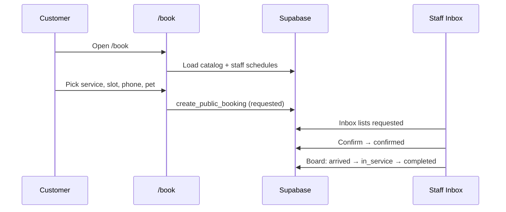

# Module Flows — Pages, UI & User Journeys

Step-by-step flows for every module in the Petverse-style clone: **what the user sees**, **which route**, **which Supabase tables**, and **what happens on each action**.

> **Single business.** One clinic (Pet Company 1). No tenant slug, no `tenant_id`. Branding from `business_settings`.

Related: [MODULES.md](./MODULES.md) · [SUPABASE-SCHEMA.md](./SUPABASE-SCHEMA.md)

---

## Build phases at a glance

| Phase | Goal | Key routes |
|-------|------|------------|
| **1 — Core** | Book online → staff confirms → run the day | `/`, `/book`, `/login`, `/admin/*` (calendar, board, inbox, catalog, team) |
| **2 — Extended** | Boarding, daycare, billing | `/admin/scheduling/boarding`, `/admin/scheduling/daycare`, `/admin/sales/*`, `/pay/:token` |
| **3 — Growth** | WhatsApp CRM, campaigns, passport, stock | `/admin/communications/*`, `/passport/:petId`, `/staff/daily_pet_updates` |

---

## App shell & navigation

### Public layout

```
┌─────────────────────────────────────────────────────────┐
│  Logo (business_settings)    [Book]  [Staff Login]      │
├─────────────────────────────────────────────────────────┤
│                     Page content                        │
└─────────────────────────────────────────────────────────┘
```

### Admin layout (after login)

```
┌──────────┬──────────────────────────────────────────────┐
│ Sidebar  │  Top bar: Search (⌘K), date, user menu       │
│          ├──────────────────────────────────────────────┤
│ Home     │                                              │
│ Schedule │              Main content                    │
│ Clients  │                                              │
│ Catalog  │                                              │
│ Comms*   │                                              │
│ Sales*   │                                              │
│ Stock*   │                                              │
│ Settings │                                              │
└──────────┴──────────────────────────────────────────────┘
  * Phase 2/3 — hide or show “Coming soon” in MVP
```

**Command palette groups:** Scheduling · Clients · Communications · Sales · Stock · Settings

---

## Appointment status pipeline (all phases)

Every scheduling module reads/writes the same status enum on `appointments`:

```text
requested → confirmed → arrived → in_service → completed
     ↓           ↓
cancelled    no_show
```

| Status | Kanban column | Who sets it |
|--------|---------------|-------------|
| `requested` | Pending Review | Online `/book` submit |
| `confirmed` | Confirmed (Upcoming) | Inbox Confirm, Board drag, Calendar |
| `arrived` | Arrived (Lobby) | Reception on board |
| `in_service` | In Service | Groomer/vet starts |
| `completed` | Completed | Staff finishes |
| `cancelled` / `no_show` | Cancelled / No Show | Staff action |

---

# PHASE 1 — CORE MODULES

Build these first. Tables: see [SUPABASE-SCHEMA.md Phase 1](./SUPABASE-SCHEMA.md#phase-1--core-implement-first).

---

## 1. Marketing landing

| | |
|---|---|
| **Route** | `/` |
| **Role** | Public (no login) |
| **Tables** | `business_settings`, `service_categories`, `services` (featured) |

### UI sections

1. **Hero** — `hero_title`, `hero_subtitle`, primary CTA “Book appointment” → `/book`
2. **Service cards** — Grooming, Boarding, Daycare categories with “Explore” → `/book?category=grooming`
3. **Social proof** — star rating, appointment count (query `appointments` count), testimonial carousel (static or CMS later)
4. **Footer** — `business_name`, copyright, optional `phone` / `address`

### Flow

```text
Visitor lands on /
  → Load business_settings (single row)
  → Load active service_categories + top services
  → Click "Book appointment" → /book
  → Click "Staff Login" → /login
```

### Data queries

- `select * from business_settings limit 1`
- `select * from service_categories where is_active order by sort_order`
- Optional: `select count(*) from appointments where status = 'completed'`

---

## 2. Online booking wizard

| | |
|---|---|
| **Route** | `/book` |
| **Role** | Public (phone lookup, no password) |
| **Tables** | `service_categories`, `services`, `service_packages`, `service_package_steps`, `employees`, `employee_schedules`, `employee_services`, `owners`, `pets`, `appointments` |

### Layout

```text
┌────────────────────────────────────┬──────────────────┐
│  Step indicator (1–5)              │  Selected details│
│  Step content (forms / pickers)    │  (live summary)  │
│  [Back]              [Continue]    │                  │
└────────────────────────────────────┴──────────────────┘
```

### Step 1 — Service

**UI:** Tabs or accordions: **Packages** · **Veterinary** · **Grooming** · **Boarding*** · **Daycare***

Each card shows: name, price, duration, step count (packages).

**Actions:**
- Select one `service` or `service_package`
- Store selection in wizard state; update sidebar

**Queries:**
- `services` where `is_public = true` and `is_active`, joined to categories
- `service_packages` + `service_package_steps` + linked services

*\*Boarding/Daycare cards can link to Phase 2 or show “Book via phone” in MVP.*

### Step 2 — Date & time

**UI:**
- Week strip (7 days) + prev/next week
- Grid of 30-minute slots for selected day
- Optional: “Preferred professional” dropdown (active `employees` who can perform service via `employee_services`)

**Slot engine logic:**
1. Load `employee_schedules` for day_of_week
2. Filter employees who can do selected service
3. Subtract existing `appointments` (status not cancelled) overlapping slot
4. If user picks preferred staff → only that column; else auto-assign first free staff on slot click

**Actions:**
- Pick date → fetch slots
- Pick slot → set `starts_at`, `ends_at`, `employee_id` (or `preferred_employee_id`)

### Step 3 — Customer

**UI:**
- Phone input with country code
- “Search” button
- If found: show owner name + “Continue”
- If not found: inline form — name (required), email (optional)

**Actions:**
- Lookup: `select * from owners where phone = $1`
- Create: `insert into owners (name, phone, email)`

### Step 4 — Pet

**UI:**
- If owner exists: radio list of their `pets`
- “Add new pet” form: name, species, breed, birth date, weight, color

**Actions:**
- Load: `select * from pets where owner_id = $1 and is_active`
- Create: `insert into pets (...)`

### Step 5 — Confirm

**UI:**
- Full summary in sidebar + main recap
- Terms note: “Request will be reviewed by our team”
- Submit button

**Actions on submit:**
1. Edge Function / RPC `create_public_booking` (service role)
2. Insert `appointments` with `status = 'requested'`, `source = 'online'`
3. For packages: one row per step, shared `group_id`, `step_order`; sequential steps may offset `starts_at`
4. Success screen: “Request received — we’ll confirm shortly”

---

## 3. Staff login

| | |
|---|---|
| **Route** | `/login` |
| **Role** | Staff / admin |
| **Tables** | Supabase Auth, `employees` |

### UI

- Email + password fields
- “Sign in” button
- Error toast on failure

### Flow

```text
Enter credentials
  → supabase.auth.signInWithPassword
  → Optional: verify employees row exists for auth.uid()
  → Redirect to /admin/home
```

Protected routes: wrap `/admin/*` in auth guard; redirect unauthenticated users to `/login`.

---

## 4. Admin home (MVP)

| | |
|---|---|
| **Route** | `/admin/home` |
| **Role** | Staff / admin |
| **Phase 1 tables** | `appointments`, `employees` |
| **Phase 3 adds** | `conversations` (WhatsApp funnel widgets) |

### MVP UI (Phase 1 only)

```text
┌─────────────────────────────────────────────────────────┐
│  Today — Saturday, Aug 29                               │
│  ┌──────────┐ ┌──────────┐ ┌──────────┐ ┌──────────┐     │
│  │ Total    │ │ Pending  │ │ Confirmed│ │ Completed│     │
│  │ today    │ │ review   │ │ upcoming │ │ today    │     │
│  └──────────┘ └──────────┘ └──────────┘ └──────────┘     │
│                                                         │
│  Quick links: Calendar · Daily Ops · Inbox (pending)    │
└─────────────────────────────────────────────────────────┘
```

### Queries

- Count appointments where `starts_at` is today, group by `status`
- Count `status = 'requested'` (link to inbox)

### Phase 3 expansion

Add WhatsApp funnel charts, lost revenue, conversation stages — requires `conversations` table.

---

## 5. Scheduling — Calendar

| | |
|---|---|
| **Route** | `/admin/scheduling/calendar` |
| **Role** | Staff |
| **Tables** | `appointments`, `employees`, `owners`, `pets`, `services` |

### UI (FullCalendar resource day view)

```text
┌──────────────────────────────────────────────────────────────┐
│  ◀  Today  ▶   Aug 29, 2026   [Day ▼]  [Filters]  [+ Add]   │
├────────┬────────┬────────┬────────┬────────┬──────────────────┤
│  Time  │ Dr.Sarah│ Dr.Ahmed│ Mike  │ Jessica│ ...              │
├────────┼────────┼────────┼────────┼────────┼──────────────────┤
│  8:00  │        │ ████ Appt│       │        │                  │
│  8:30  │        │ ████     │       │        │                  │
│  ...   │        │          │       │        │                  │
└────────┴────────┴────────┴────────┴────────┴──────────────────┘
```

**Event card:** pet name, service, status color, owner phone on hover.

### Flows

| Action | Result |
|--------|--------|
| Click empty slot | Open “New appointment” drawer — pick owner, pet, service, save as `confirmed`, source `admin` |
| Click event | Side panel: edit time, staff, status, notes |
| Drag event | Update `starts_at`, `ends_at`, maybe `employee_id` |
| Change status dropdown | Update `appointments.status` |

### Queries

- `employees` where `is_active`
- `appointments` where date range + join owner, pet, service

---

## 6. Scheduling — Daily Ops board

| | |
|---|---|
| **Route** | `/admin/scheduling/board` |
| **Role** | Reception + floor staff |
| **Tables** | `appointments`, `owners`, `pets`, `services`, `employees` |

### UI (Kanban)

```text
Date: ◀ Today ▶

┌─────────────┬─────────────┬─────────┬───────────┬───────────┬─────────────┐
│ Pending     │ Confirmed   │ Arrived │ In Service│ Completed │ Cancelled   │
│ Review      │ (Upcoming)  │ (Lobby) │           │           │ / No Show   │
├─────────────┼─────────────┼─────────┼───────────┼───────────┼─────────────┤
│ [Card]      │ [Card]      │ [Card]  │ [Card]    │ [Card]    │             │
│ [Card]      │             │         │           │           │             │
└─────────────┴─────────────┴─────────┴───────────┴───────────┴─────────────┘
```

**Card content:** Pet avatar/initial, pet name, service, time, assigned staff, owner phone, package badge if `group_id` set.

### Flows

| Action | Result |
|--------|--------|
| Drag card to next column | Map column → `appointment_status`, PATCH row |
| Click card | Detail drawer: notes, quick call link |
| Confirm from Pending | `requested` → `confirmed` |
| Mark arrived | `confirmed` → `arrived` |
| Start service | `arrived` → `in_service` |
| Complete | `in_service` → `completed` |
| Cancel / no-show | → `cancelled` or `no_show` + optional `cancel_reason` |

Uses **@dnd-kit** for drag-and-drop between columns.

---

## 7. Communications — Inbox (appointment queue)

| | |
|---|---|
| **Route** | `/admin/communications/inbox` |
| **Role** | Reception |
| **Phase 1 tables** | `appointments`, `owners`, `pets`, `services`, `employees` |
| **Phase 3 adds** | `conversations`, `conversation_messages` (WhatsApp panel) |

### Phase 1 UI (booking queue only)

```text
┌─────────────────────┬────────────────────────────────────────┐
│ Message Queue       │  Mini calendar (context)               │
│ ─────────────────   │                                        │
│ ● Bella — Grooming  │  Same resource day view as calendar    │
│   Aug 30, 10:00     │  (optional, right panel)               │
│   OVERDUE 2h        │                                        │
│   [Confirm][Reject] │                                        │
│ ─────────────────   │                                        │
│ ● Max — Vet Checkup │                                        │
└─────────────────────┴────────────────────────────────────────┘
```

### Confirm flow

```text
Staff clicks Confirm on requested appointment
  → UPDATE appointments SET status = 'confirmed'
  → Card leaves queue; appears on board "Confirmed" and calendar
  → (Phase 3) Optional: send SMS/email confirmation
```

### Reject flow

```text
Staff clicks Reject
  → Modal: cancel reason
  → UPDATE status = 'cancelled', cancelled_at, cancel_reason
  → (Phase 3) Notify owner
```

**Package bookings:** Queue item shows all steps in group (`group_id`); Confirm applies to whole group or per-step depending on product rule (Petverse confirms all steps together).

---

## 8. Clients — Owners

| | |
|---|---|
| **Route** | `/admin/clients/owners` |
| **Role** | Staff |
| **Tables** | `owners`, `pets`, `appointments` |

### UI

- Searchable table: name, phone, email, pet count, last visit
- Row click → owner profile drawer/page

### Owner profile

- Contact fields (editable)
- Linked pets list → link to pet profile
- Appointment history table
- Phase 3: retention status, lifetime spend

### CRUD flows

| Action | Result |
|--------|--------|
| Add owner | Insert `owners` |
| Edit | Update contact fields |
| View history | `appointments` where `owner_id` order by `starts_at` desc |

---

## 9. Clients — Pets

| | |
|---|---|
| **Route** | `/admin/clients/pets` |
| **Role** | Staff |
| **Tables** | `pets`, `owners`, `appointments` |

### UI

- Filterable list: name, species, breed, owner name
- Pet detail: profile fields, notes, appointment history
- Link: “View passport” → `/passport/:petId` (Phase 3)

### CRUD

Standard create/edit/deactivate (`is_active = false`).

Phase 3 adds: vaccinations, boarding instructions, consent submissions, photo gallery.

---

## 10. Catalog — Categories

| | |
|---|---|
| **Route** | `/admin/catalog/categories` |
| **Tables** | `service_categories` |

### UI

- Sortable list (drag to reorder `sort_order`)
- Modal: name, slug, description, active toggle

---

## 11. Catalog — Services

| | |
|---|---|
| **Route** | `/admin/catalog/services` |
| **Tables** | `services`, `service_categories`, `employee_services` |

### UI

- Table: name, category, kind, duration, price, public toggle, active toggle
- Form: all fields + multi-select staff who can perform (`employee_services`)

### Flow

```text
Create service
  → INSERT services
  → INSERT employee_services for selected staff
  → Service appears on /book if is_public
```

---

## 12. Catalog — Packages

| | |
|---|---|
| **Route** | `/admin/catalog/packages` |
| **Tables** | `service_packages`, `service_package_steps`, `services` |

### UI

- Package list with step count and total duration/price
- Package editor:
  - Name, description, price, duration, step mode (sequential | parallel)
  - Step builder: pick service, optional duration override, order index

### Flow

```text
Save package
  → UPSERT service_packages
  → Replace service_package_steps rows
  → /book step 1 shows under "Packages"
```

---

## 13. Settings — Team

| | |
|---|---|
| **Route** | `/admin/settings/team` |
| **Tables** | `employees`, `employee_schedules`, `employee_services`, Auth users |

### UI

- Staff cards: avatar/initials, name, role badge, job title, color swatch
- Actions: Edit, Manage Schedule, Deactivate

### Manage Schedule modal

- 7-row grid (Sun–Sat): start time, end time, or “Off”
- Saves to `employee_schedules` (delete + reinsert for employee)

### Add staff flow

```text
Admin creates employee row
  → Invite user: Supabase Auth signup or link existing user_id
  → Assign role, color (calendar column), services
```

Phase 3: `employee_commission_tiers`.

---

## 14. Settings — Profile (business)

| | |
|---|---|
| **Route** | `/admin/settings/profile` |
| **Tables** | `business_settings`, Storage `business-assets` |

### UI

- Form: business name, logo upload, timezone, currency, phone, email, address, hero title/subtitle
- Save updates the singleton row

---

# PHASE 2 — EXTENDED MODULES

Add after core booking works. Tables: [SUPABASE-SCHEMA Phase 2](./SUPABASE-SCHEMA.md#phase-2--extended-ops-after-mvp).

---

## 15. Boarding

| **Route** | `/admin/scheduling/boarding` |
| **Tables** | `facility_resources`, `reservations`, `boarding_waitlist`, `attendance_entries`, `room_transfers`, `pet_boarding_instructions` |

### Tabs & flows

| Tab | UI | Main actions |
|-----|-----|--------------|
| **Room Board** | Grid of kennels/suites by column/row | Click vacant cell → new reservation; occupied → check-in/out |
| **Timeline** | Gantt-style reservations | Drag to change dates |
| **Attendance** | Daily check-in log | Mark arrived / departed |
| **Waitlist** | Queue when full | Promote to reservation when room frees |
| **Facilities** | CRUD rooms | Set capacity, type, grid position |

**Status flow:** `pending` → `confirmed` → `checked_in` → `checked_out`

---

## 16. Daycare

| **Route** | `/admin/scheduling/daycare` |
| **Tables** | `daycare_pricing`, `daycare_packages`, `daycare_wallets`, `daycare_schedules`, `daycare_transactions` |

### Tabs & flows

| Tab | Flow |
|-----|------|
| **Today** | List expected + checked-in pets; **Check In** creates `daycare_transactions` |
| **History** | Past sessions, filter by date |
| **Schedules** | Recurring weekday pattern per pet |
| **Billing** | Sell package → credit wallet; deduct on check-in |

Public `/book` can offer Daycare Full/Half Day once pricing table exists.

---

## 17. Sales — Invoices & checkout

| **Routes** | `/admin/sales/invoices`, `/admin/sales/checkout-history`, `/admin/sales/daily-summary` |
| **Tables** | `invoices`, `invoice_line_items`, `deposits`, `products` (Phase 3) |

### Create invoice flow

```text
From appointment or walk-in
  → allocate_invoice_number()
  → INSERT invoice + line items (services, products)
  → Status: draft → open → paid
  → Generate payment_tokens row for /pay/:token
```

---

## 18. Public payment link

| **Route** | `/pay/:token` |
| **Tables** | `payment_tokens`, `invoices`, `deposits` |

### Flow

```text
Owner opens link from SMS/email
  → Load token (valid, not expired)
  → Show amount, line items
  → Pay via Square (or stub)
  → Webhook marks invoice paid / records deposit
  → Thank-you screen
```

---

# PHASE 3 — GROWTH MODULES

Tables: [SUPABASE-SCHEMA Phase 3](./SUPABASE-SCHEMA.md#phase-3--growth-later).

---

## 19. Communications — WhatsApp inbox (full)

**Route:** `/admin/communications/inbox` (extends Phase 1 queue)

**Tables:** `conversations`, `conversation_messages`, `message_templates`

### Conversation stages

```text
inquiry → engaged → quoted → booked → visited
                              ↘ closed_lost
```

**UI additions:** Left panel tabs — Bookings | WhatsApp; thread view; stage tags; AI draft reply; quoted amount; closed-lost reason.

**Home dashboard** widgets consume conversation aggregates.

---

## 20. Campaigns & outbound

| **Routes** | `/admin/communications/campaigns`, `/outbound`, `/reminder-log` |
| **Tables** | `outbound_campaigns`, `campaign_contacts`, `campaign_blackout_periods`, `reminder_log` |

Flow: build audience → schedule send → respect blackout → log in `reminder_log`.

---

## 21. Pet passport (public)

| **Route** | `/passport/:petId` |
| **Tables** | `pets`, `owners`, `pet_vaccinations`, `pet_photos`, `pet_notes` |

Shareable read-only (or token-gated) page: profile, health vault, photos, linked owners.

---

## 22. Staff daily pet updates

| **Route** | `/staff/daily_pet_updates` |
| **Tables** | `daily_updates`, `pet_update_images`, Storage |

### Flow

```text
Staff selects active appointment/pet
  → Write note + upload photos
  → INSERT daily_updates + pet_update_images
  → (Optional) Push to owner via SMS/WhatsApp
```

Floor staff shortcut — separate from heavy admin chrome if desired.

---

## 23. Stock, vaccines, consent, retention

| Module | Route | Purpose |
|--------|-------|---------|
| Products | `/admin/stock/products` | Retail SKUs at checkout |
| Suppliers | `/admin/stock/suppliers` | Vendor directory |
| Vaccines | `/admin/settings/vaccines` | Vaccine type catalog |
| Consent forms | `/admin/settings/consent-forms` | Templates + service linkage |
| Retention | `/admin/settings/retention` | Re-engagement rules |
| Targets | `/admin/settings/targets` | KPI targets vs actuals |

---

# End-to-end journeys

## A. Customer books grooming (Phase 1)



## B. Staff runs the day (Phase 1)

```text
/login → /admin/home (see pending count)
  → /admin/communications/inbox — confirm morning requests
  → /admin/scheduling/board — move cards through lobby → in service → done
  → /admin/scheduling/calendar — handle walk-ins (+ Add)
  → /admin/clients/pets — update notes if needed
```

## C. Boarding stay (Phase 2)

```text
/book or admin — create reservation
  → Room Board assigns facility_resource
  → Check-in on arrival (attendance_entries)
  → Room transfer if needed
  → Check-out → invoice (Phase 2 billing)
```

---

# Frontend route map (complete)

| Route | Phase | Module |
|-------|-------|--------|
| `/` | 1 | Landing |
| `/book` | 1 | Booking wizard |
| `/login` | 1 | Auth |
| `/admin/home` | 1 | Dashboard |
| `/admin/scheduling/calendar` | 1 | Calendar |
| `/admin/scheduling/board` | 1 | Daily Ops |
| `/admin/communications/inbox` | 1 | Booking queue |
| `/admin/clients/owners` | 1 | Owners CRM |
| `/admin/clients/pets` | 1 | Pets CRM |
| `/admin/catalog/categories` | 1 | Categories |
| `/admin/catalog/services` | 1 | Services |
| `/admin/catalog/packages` | 1 | Packages |
| `/admin/settings/profile` | 1 | Business settings |
| `/admin/settings/team` | 1 | Team |
| `/admin/scheduling/boarding` | 2 | Boarding |
| `/admin/scheduling/daycare` | 2 | Daycare |
| `/admin/sales/*` | 2 | Billing |
| `/pay/:token` | 2 | Payment link |
| `/admin/communications/campaigns` | 3 | Campaigns |
| `/passport/:petId` | 3 | Pet passport |
| `/staff/daily_pet_updates` | 3 | Daily updates |

---

# Related documents

- [MODULES.md](./MODULES.md) — feature list and API notes per module
- [SUPABASE-SCHEMA.md](./SUPABASE-SCHEMA.md) — table definitions by phase
- [ARCHITECTURE.md](./ARCHITECTURE.md) — full technical reference (legacy Prisma schema)
