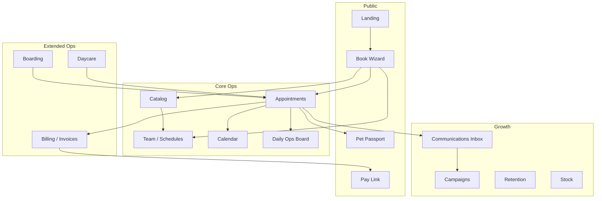

# Pet Care Booking Platform — Module Reference

This document describes every functional module in the [Petverse demo app](https://petverse-nine.vercel.app/) we scanned, mapped to routes, user roles, and backend responsibilities. Use it as the product spec for our clone.

**Reference app:** Pet Company 1 (petverse-nine.vercel.app)  
**Our stack:** Supabase (PostgreSQL + Auth + Storage) + Vite/React SPA  
**Scope:** Single business (e.g. Pet Company 1) — not multi-tenant

---

## Product overview

The app is a **multi-service pet care operations platform** for **one clinic**. It combines:

1. **Grooming & veterinary appointments** — bookable services with staff assignment and a status pipeline.
2. **Boarding** — overnight stays with room/facility management.
3. **Daycare** — check-in/check-out, packages, wallets, and billing.

Customers book online without passwords (phone lookup). Staff log in to run the day from calendar, kanban board, and a confirmation queue. Reception and marketing layers add WhatsApp inquiry tracking, campaigns, and retention analytics.

---

## User roles & surfaces

| Role | Access | Primary surfaces |
|------|--------|------------------|
| **Pet parent (public)** | No account required | Landing, `/book`, `/pay/:token`, `/passport/:petId` |
| **Staff** | JWT login | `/admin/*`, `/staff/daily_pet_updates` |
| **Admin / owner** | Full staff permissions | All admin modules + settings |

---

## Public modules

### 1. Marketing landing (`/`)

**Purpose:** Business-branded homepage that drives bookings and staff login.

**Features observed:**
- Hero with value props (grooming, wellness, boarding)
- Service category cards (Grooming, Boarding, Daycare) with “Explore” links
- Social proof: ratings, appointment counts, testimonials carousel
- CTAs: “Book appointment”, “Staff Login”
- Footer with copyright

**Data:** Mostly static content from `business_settings` (name, logo, copy). Optional stats from appointment counts.

**API needs:**
- `GET business_settings` — branding + featured services (Supabase select)

---

### 2. Online booking wizard (`/book`)

**Purpose:** Self-service appointment booking in five steps.

**Steps:**

| Step | UI | Behavior |
|------|-----|----------|
| 1. Service | Grouped catalog: Packages, Veterinary, Boarding, Daycare | Select service or package; show price, duration, step count for packages |
| 2. Date & time | Week strip, 30-min slots, optional staff preference | Compute availability from staff schedules minus existing bookings; auto-assign professional when slot selected |
| 3. Customer | Mobile number search | Lookup owner by phone; if not found, offer “Create New Profile” (name + optional email) |
| 4. Pet | Select or add pet | Choose from owner’s pets or create new (species, breed, etc.) |
| 5. Confirm | Summary sidebar + submit | Create appointment with status **requested** (not auto-confirmed) |

**Package types:**
- **Sequential:** Step B starts after Step A (e.g. Bath & Brush → Full Grooming).
- **Parallel:** Steps run at the same time (e.g. Consultation + Nail Trim).

**Sidebar:** Live “Selected details” (service, professional, date/time, customer, pet).

**API needs:**
- `GET /api/public/:slug/catalog` — categories, services, packages with steps
- `GET /api/public/:slug/slots?serviceId=&date=&staffId?` — available times
- `GET /api/public/:slug/owners/lookup?phone=` — owner + pets
- `POST /api/public/:slug/owners` — create owner
- `POST /api/public/:slug/pets` — create pet
- `POST /api/public/:slug/bookings` — create requested appointment(s)

---

### 3. Staff login (`/login`)

**Purpose:** Email/password authentication for admin dashboard.

**Behavior:** JWT session; redirect to `/admin/home` on success.

**Already in our backend:** `POST /api/auth/login`, `POST /api/auth/register`.

---

### 4. Payment link (`/pay/:token`)

**Purpose:** Customer pays deposit or invoice via a secure tokenized URL (no login).

**Behavior:** Loads invoice/deposit by token; integrates with payment provider (Square mentioned in reference bundle).

**API needs:**
- `GET /api/public/pay/:token` — payment intent details
- `POST /api/public/pay/:token/confirm` — webhook / confirmation

---

### 5. Pet passport (`/passport/:petId`)

**Purpose:** Owner-facing pet profile page (shareable link).

**Sections observed in bundle:**
- Profile information (editable by staff)
- Health vault / vaccination records
- Circle of Care, Pet-Life Log
- Cost & insurance
- Photos gallery
- Linked humans (owners)

**API needs:**
- `GET /api/public/passport/:petId` — read-only pet profile (optionally token-gated)

---

### 6. Staff daily updates (`/staff/daily_pet_updates`)

**Purpose:** Floor staff capture photos and notes during visits and send updates to owners.

**Behavior:** Photo upload to storage; links to `daily_updates` and `pet_update_images`.

**API needs:**
- CRUD on daily updates; file upload endpoint

---

## Admin modules

Admin uses a **command palette** (Search…) grouped into: Scheduling, Clients, Communications, Sales, Stock, Settings.

### 7. Home dashboard (`/admin/home`)

**Purpose:** Executive view of today’s operations and WhatsApp sales funnel.

**Widgets:**
- **Today:** date, appointment count, checked-in vs upcoming, pipeline value (AED)
- **Top staff this month**
- **WhatsApp Funnel & Revenue:** inquiries, inquiry→booking %, booking→visit %, avg first response, lost revenue
- **Conversation funnel:** Inquiries → Engaged → Quoted → Booked → Visited (with drop-off %)
- **Closed-lost reasons:** Price, unresponsive, etc.
- **Lost revenue breakdown:** unconverted inquiries, no-shows, late cancellations, unbooked quotes
- **Lead engagement:** lead time, follow-up delays, open inquiries by age
- **Daily inquiry volume** (14 days)
- **Daily close-the-loop report** (table by date)

**Depends on:** Communications module (WhatsApp conversations) + appointments.

---

### 8. Scheduling — Calendar (`/admin/scheduling/calendar`)

**Purpose:** Resource calendar — day/week view with one column per staff member.

**Features:**
- Staff columns with avatar, name, role (Veterinarian, Groomer, etc.)
- Time grid (8am–6pm+, 30-min increments)
- Navigation: Today, prev/next day, date picker
- Filters, calendar settings, waitlist, refresh
- View modes: Day (and likely week)
- **Add** — create appointment manually
- Drag/drop appointments (FullCalendar resource view)

**Live staff roster example:** Dr. Sarah Connor, Dr. Ahmed Rashid, Mike Ross, Jessica Pearson, Layla Hassan, Tom Chen.

**API needs:**
- `GET /api/tenants/:id/calendar?date=&view=` — events by employee
- CRUD appointments with staff + time assignment

---

### 9. Scheduling — Daily Ops board (`/admin/scheduling/board`)

**Purpose:** Kanban pipeline for same-day appointment flow.

**Columns:**
1. Pending Review
2. Confirmed (Upcoming)
3. Arrived (Lobby)
4. In Service
5. Completed
6. Cancelled / No Show

**Behavior:** Cards move between columns as status changes; date filter (Today + navigation).

**Maps to appointment statuses:** `requested` → `confirmed` → `arrived` → `in_service` → `completed` | `cancelled` | `no_show`

---

### 10. Scheduling — Boarding (`/admin/scheduling/boarding`)

**Purpose:** Manage overnight boarding reservations and room occupancy.

**Tabs:**
| Tab | Purpose |
|-----|---------|
| **Room Board** | Grid of rooms by column/row layout; vacant vs occupied; print view |
| **Timeline** | Reservations over time |
| **Attendance** | Check-in/out tracking |
| **Waitlist** | Queue when no rooms available |
| **Facilities** | Configure rooms, kennels, suites, playrooms (grid positions) |

**Room examples:** Standard Kennel A1/A2, Luxury Suite VIP, Small/Big Dog Playroom.

**API needs:** reservations, facility_resources, room_transfers, boarding_waitlist, attendance_entries, boarding instructions.

---

### 11. Scheduling — Daycare (`/admin/scheduling/daycare`)

**Purpose:** Daycare operations separate from grooming appointments.

**Tabs:**
| Tab | Purpose |
|-----|---------|
| **Today** | Active check-ins, status filter, Check In button |
| **History** | Past sessions |
| **Schedules** | Recurring daycare schedules |
| **Billing** | Wallets, packages, pending payments |

**Services:** Daycare Full Day, Half Day (bookable from public wizard too).

**API needs:** daycare_transactions, daycare_schedules, daycare_wallet, daycare_packages, daycare_pricing.

---

### 12. Clients — Owners (`/admin/clients/owners`)

**Purpose:** CRM for pet parents.

**Fields / analytics (from bundle):**
- Contact info, preferred contact method
- Retention status
- Last visited (any service), last grooming/boarding/daycare/vet
- Lifetime bookings, lifetime spend
- Pet birthday upcoming
- View profile, custom fields

**API needs:** CRUD owners; retention aggregates.

---

### 13. Clients — Pets (`/admin/clients/pets`)

**Purpose:** Pet records linked to owners.

**Features:**
- Species, breed, age, weight, color, notes
- Vaccination log
- Boarding instructions (+ history)
- Consent forms
- Appointment history
- Link to passport view
- Photos, documents

**API needs:** CRUD pets; nested notes, vaccinations, documents.

---

### 14. Catalog — Services (`/admin/catalog/services`)

**Purpose:** Define bookable services.

**Attributes:** name, category, duration_minutes, price, description, staff assignment, consent form linkage.

**Categories:** Grooming, Veterinary, Boarding, Daycare, etc.

---

### 15. Catalog — Categories (`/admin/catalog/categories`)

**Purpose:** Group services for public book page and admin filters.

---

### 16. Catalog — Packages (`/admin/catalog/packages`)

**Purpose:** Bundled multi-step offerings.

**Features:**
- Sequential vs parallel step execution
- Per-step service, optional duration/price overrides
- Package-level deposit or discount

**Examples:** Deluxe Spa Package, Vet & Groom Combo, Vet Checkup Bundle.

---

### 17. Communications — Inbox / Unibox (`/admin/communications/inbox`)

**Purpose:** Unified queue for **pending online bookings** and **WhatsApp conversations**.

**Message Queue (left panel):**
- Lists requested appointments with pet, owner, service, date, overdue indicator
- Package bookings show all steps with assigned staff/times
- **Confirm** / **Reject** actions
- Tabs/filters on queue

**Calendar panel:** Same resource calendar for scheduling context while reviewing requests.

**Conversation features (bundle):** stage tags (inquiry → engaged → quoted → booked → visited), AI draft reply, attachments, closed-lost reasons.

---

### 18. Communications — Inbox V2 (`/admin/communications/inbox-v2`)

**Purpose:** Next-generation inbox UI (parallel implementation in reference app).

---

### 19. Communications — Outbound (`/admin/communications/outbound`)

**Purpose:** Outbound message campaigns and templates.

---

### 20. Communications — Reports (`/admin/communications/reports`)

**Purpose:** Analytics on messaging performance (feeds home funnel).

---

### 21. Communications — Reminder log (`/admin/communications/reminder-log`)

**Purpose:** Audit trail of SMS/email/WhatsApp reminders sent.

---

### 22. Communications — Photos (`/admin/communications/photos`)

**Purpose:** Capture, sort, and send daily pet photos to owners.

**Workflow:** Sort unsorted photos onto pets; bulk send.

---

### 23. Communications — Campaigns (`/admin/communications/campaigns`)

**Purpose:** Marketing campaigns with contact lists, blackout periods, compare runs.

**Routes:** list, `new`, `:id`, `compare`.

---

### 24. Sales — Daily summary (`/admin/sales/daily-summary`)

**Purpose:** End-of-day revenue and activity rollup.

---

### 25. Sales — Appointments (`/admin/sales/appointments`)

**Purpose:** Searchable list of all appointments with filters and bulk actions.

**Actions:** Create, edit, delete, cancel; group appointments; override duration/price.

---

### 26. Sales — Invoices (`/admin/sales/invoices`)

**Purpose:** Billing documents with line items.

**Features:** Invoice numbering (`allocate_invoice_number`), void invoice, link to checkout.

---

### 27. Sales — Checkout history (`/admin/sales/checkout-history`)

**Purpose:** Record of completed point-of-sale transactions.

---

### 28. Sales — Reports (`/admin/sales/reports`)

**Purpose:** Revenue reports, staff commissions, service mix.

---

### 29. Stock — Products (`/admin/stock/products`)

**Purpose:** Retail products sold at checkout (add-ons, retail items).

---

### 30. Stock — Suppliers (`/admin/stock/suppliers`)

**Purpose:** Supplier directory for inventory.

---

### 31. Settings — Profile (`/admin/settings/profile`)

**Purpose:** Business profile — name, logo, timezone, currency, contact info.

---

### 32. Settings — Team (`/admin/settings/team`)

**Purpose:** Employees (staff) management.

**Features:**
- Roles: Veterinarian, Groomer, Boarding Attendant, Vet Technician, Admin
- Avatar, assigned services
- Working schedules (`Manage Schedule`)
- Commission tiers

**Note:** `Employee` links to Supabase Auth via `employees.user_id`.

---

### 33. Settings — Vaccines (`/admin/settings/vaccines`)

**Purpose:** Vaccine type catalog for logging on pets.

---

### 34. Settings — Consent forms (`/admin/settings/consent-forms`)

**Purpose:** Templates linked to services; capture submissions on check-in.

---

### 35. Settings — Retention (`/admin/settings/retention`)

**Purpose:** Rules for re-engaging lapsed customers (feeds owner retention analytics).

---

### 36. Settings — Targets (`/admin/settings/targets`)

**Purpose:** Business KPI targets (revenue, bookings, etc.).

---

### 37. Settings — Support (`/admin/settings/support`)

**Purpose:** Help / support contact for the tenant.

---

## Cross-cutting concerns

### Appointment status pipeline

```
requested → confirmed → arrived → in_service → completed
                ↓           ↓
           cancelled    no_show
```

Online bookings start at **requested** until staff confirms from Inbox or Daily Ops.

### Single business

All records belong to one clinic. Public routes do not use a slug — branding comes from the singleton `business_settings` row.

### Permissions (already defined in our backend)

| Domain | Keys |
|--------|------|
| Appointments | `appointments:read`, `appointments:write`, `appointments:delete` |
| Customers | `customers:read`, `customers:write`, `customers:delete` |
| Services | `services:read`, `services:write`, `services:delete` |
| Availability | `availability:read`, `availability:write` |

Extend with: `billing:*`, `communications:*`, `inventory:*`, `settings:*` as modules are built.

### Integrations (reference app)

| Integration | Usage |
|-------------|--------|
| **WhatsApp** | Inquiry funnel, Unibox, reminders |
| **Resend** | Transactional email |
| **Square** | Payments / checkout |
| **Object storage** | Pet photos, documents |
| **FullCalendar** | Resource scheduling UI |

Our clone can defer WhatsApp and payments until core booking works; stub webhooks and token pay links in schema.

---

## Recommended build order

1. **Foundation** — Public landing, login, admin shell, `business_settings`  
2. **Catalog + team** — Services, packages, employees, schedules  
3. **Booking core** — Public wizard, slot engine, calendar, Daily Ops, Inbox confirm/reject  
4. **Billing** — Invoices, checkout, deposits  
5. **Boarding + daycare** — Rooms, reservations, check-in, wallets  
6. **Growth** — WhatsApp funnel, campaigns, photos, passport, retention, stock  

---

## Module dependency graph



---

## Related documents

- [MODULE-FLOWS.md](./MODULE-FLOWS.md) — step-by-step flows, pages, and UI per module
- [SUPABASE-SCHEMA.md](./SUPABASE-SCHEMA.md) — Supabase tables by phase
- [ARCHITECTURE.md](./ARCHITECTURE.md) — full technical reference
